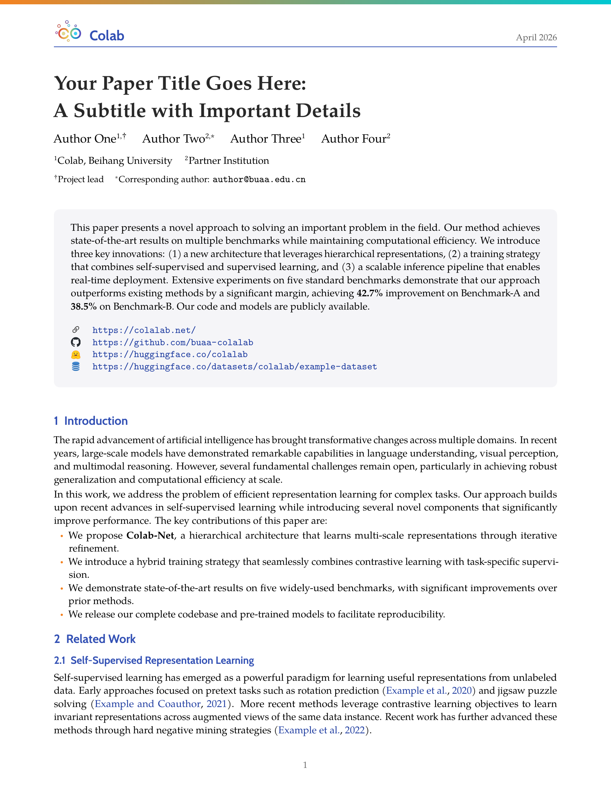
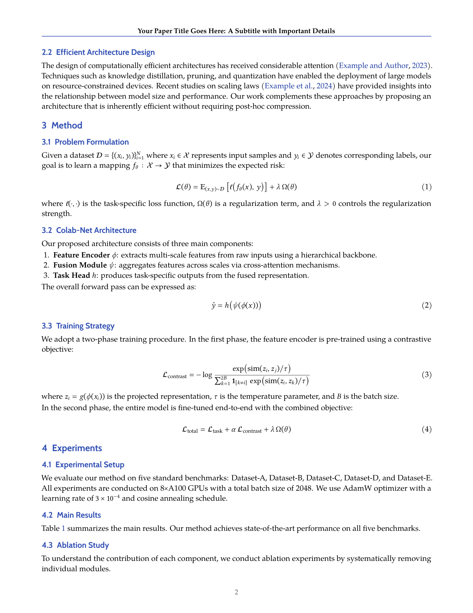
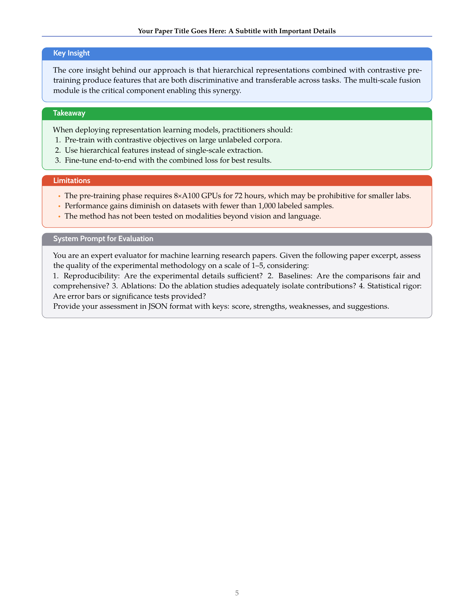

# Colab 论文模板使用说明

本模板旨在为北京航空航天大学 Colab 实验室成员提供一个开箱即用、专业美观的 arXiv LaTeX 论文模板。

---

## 效果预览

完整效果请查看 [main.pdf](main.pdf)。

| 首页 | 正文 | 附录彩色框 |
|:---:|:---:|:---:|
|  |  |  |

---

## 设计理念
 
- **专业但不刻板** —— 有配色和装饰，但克制
- **开箱即用** —— 已加载常用的 LaTeX 包，不需要再去找包、调格式
- **pdflatex 编译** —— 兼容性最好，Overleaf 直接可用

---

## 模板优势

### 1. 精心调配的字体组合

经过 20+ 种字体方案的对比测试，最终选定：

| 用途 | 字体 | 选择理由 |
|------|------|----------|
| 正文 | **Palatino** (TeX Gyre Pagella) | 古典优雅，x-height 大，长文阅读舒适 |
| 数学 | **Libertinus Math** | 与 Palatino 笔画粗细协调，公式美观 |
| 标题 | **Cabin** (sans-serif) | 现代感，与正文衬线形成层次对比 |
| 代码 | **zlmtt** (mono) | 比例合适，不会过宽占空间 |

### 2. Colab 元素视觉设计

- 首页顶部的 **橙→青渐变装饰条**，取自 Logo 的双环配色
- 页眉左侧 Logo + "Colab" 标识（仅首页），其他页面显示论文 running title
- 标题和 section 使用统一的 **Colab Blue** (`RGB 50,80,180`)
- 列表 bullet 使用 **Colab Orange** (`RGB 245,130,32`)

### 3. 摘要下方资源链接行

考虑到我们的论文通常会开源代码和模型，模板内置了带图标的链接渲染。
只需在导言区填写 URL，不填则自动隐藏。

### 4. 引用格式一键切换

不同会议对引用格式要求不同，我们支持一行切换：

```latex
\usepackage[citestyle=authoryear]{colab}  % (Author, Year) 
\usepackage[citestyle=numbers]{colab}     % [1] 编号 
```

### 5. 50+ 常用包预加载

写论文时不用再一个个找包加载。以下全部已在 `colab.sty` 中配置好：

- **数学**：amsmath, mathtools, bm, amsthm, mathrsfs, dsfont, siunitx, upgreek
- **表格**：booktabs, multirow, makecell, tabularx, threeparttable, longtable, colortbl, diagbox
- **图形**：xcolor, graphicx, subcaption, wrapfig, tikz, pgfplots
- **算法**：algorithm, algorithmic
- **代码**：listings
- **引用**：natbib, cleveref, hyperref, bookmark
- **排版**：microtype, enumitem, soul, ulem, fancyvrb, lineno

### 6. 附录彩色框环境

用于在 Appendix 中展示 Prompt、关键发现等结构化内容：

| 环境 | 颜色 |
|------|------|
| `\begin{colabinsight}` | 蓝色 |
| `\begin{colabtakeaway}` | 绿色 |
| `\begin{colablimitations}` | 红色 |
| `\begin{colabprompt}` | 灰色 |

---

## 文件结构

```
base-Palatino-LibertinusMath/
├── main.tex            # 主文档
├── colab.sty           # 样式包 ← 一般不需要动
├── references.bib      # 参考文献 ← 把你的 bib 条目放这里
├── logo/               # 图标资源 ← 不要删
│   ├── colab_logo.png
│   ├── github-logo.pdf
│   ├── huggingface-logo.pdf
│   ├── database-logo.pdf
│   └── link-logo.pdf
└── docs/               # README 配图
```

---

## 使用教程

### Step 1：获取模板

将本模板文件夹复制到你的工作目录，或上传到 Overleaf。

### Step 2：修改论文元信息

打开 `main.tex`，找到 "Paper Metadata" 区域，修改以下内容：

```latex
\title{你的论文标题：\\可以带副标题}

\author{%
  张三$^{1,\dagger}$ \quad
  李四$^{2,*}$ \quad
  王五$^{1}$ \\[6pt]
  {\normalsize $^{1}$Colab, Beihang University \quad $^{2}$Partner Institution} \\[3pt]
  {\small $^{\dagger}$Project lead \quad $^{*}$Corresponding author: \texttt{email@buaa.edu.cn}}
}

\labname{Colab}
\colabdate{May 2026}                          % 日期
\paperurl{https://arxiv.org/abs/xxxx.xxxxx}   % 论文链接
\githuburl{https://github.com/buaa-colalab/your-repo}
\huggingfaceurl{https://huggingface.co/colalab/your-model}
\dataurl{https://huggingface.co/datasets/colalab/your-data}

% 页眉运行标题（简短版论文名）
\colabrunningtitle{Your Short Paper Title}
```

> **提示**：如果某项链接（如 HuggingFace）暂时没有，留空即可，不会显示。

### Step 3：写摘要

```latex
\begin{colababstract}
在此写摘要...不需要写 "Abstract" 标题，模板会自动处理格式。

\vspace{0.4cm}
\colablinks          % 自动渲染上面填的链接
\end{colababstract}
```

### Step 4：写正文

删掉示例内容，像正常写论文一样使用 `\section{}`、`\subsection{}`：

```latex
\section{Introduction}
Your text here...

\section{Method}
\subsection{Problem Formulation}
\begin{equation}
  \mathcal{L}(\theta) = \mathbb{E}_{(x,y)}[\ell(f_\theta(x), y)]
\end{equation}
```

### Step 5：管理参考文献

在 `references.bib` 中添加你的文献条目：

```bibtex
@inproceedings{yourpaper2026,
  author    = {Zhang, San and Li, Si},
  title     = {Your Paper Title},
  booktitle = {Proceedings of NeurIPS},
  year      = {2026}
}
```

正文中引用：
```latex
\citep{yourpaper2026}   % → (Zhang and Li, 2026)
\citet{yourpaper2026}   % → Zhang and Li (2026)
```

### Step 6：编译

```bash
pdflatex main.tex
bibtex main
pdflatex main.tex
pdflatex main.tex
```

Overleaf 用户无需手动操作，保存即自动编译。

---

## 环境要求

- TeX Live 2020+ 或 MiKTeX（推荐 TeX Live Full）
- Overleaf 直接可用，无需配置
- 字体包：`tgpagella`、`libertinust1math`、`cabin`、`zlmtt`（TeX Live Full 已包含）

---

## 参考论文

本模板在设计过程中参考了以下论文的排版风格：

| # | 论文 | 机构 | 链接 |
|:---:|---|---|:---:|
| 1 | Self-Forcing++: Towards Minute-Scale High-Quality Video Generation | ByteDance Seed | [arXiv:2510.02283](https://arxiv.org/abs/2510.02283) |
| 2 | Scaling Agents via Continual Pre-training | Tongyi DeepResearch | [arXiv:2509.13310](https://arxiv.org/abs/2509.13310) |
| 3 | V-JEPA 2: Self-Supervised Video Models Enable Understanding, Prediction and Planning | Meta FAIR | [arXiv:2506.09985](https://arxiv.org/abs/2506.09985) |
| 4 | Gemini Robotics 1.5: Pushing the Frontier of Generalist Robots with Foundation Models | Google DeepMind | [arXiv:2510.03342](https://arxiv.org/abs/2510.03342) |
| 5 | Does Reinforcement Learning Really Incentivize Reasoning Capacity in LLMs Beyond the Base Model? | Tsinghua University | [arXiv:2504.13837](https://arxiv.org/abs/2504.13837) |
| 6 | X-VLA: Soft-Prompted Transformer as Scalable Cross-Embodiment Vision-Language-Action Model | Tsinghua University | [arXiv:2510.10274](https://arxiv.org/abs/2510.10274) |
| 7 | World Action Models are Zero-shot Policies | NVIDIA | [arXiv:2409.15634](https://arxiv.org/abs/2409.15634) |
| 8 | A Pragmatic VLA Foundation Model | Ant Group | [arXiv:2601.18692](https://arxiv.org/abs/2601.18692) |
